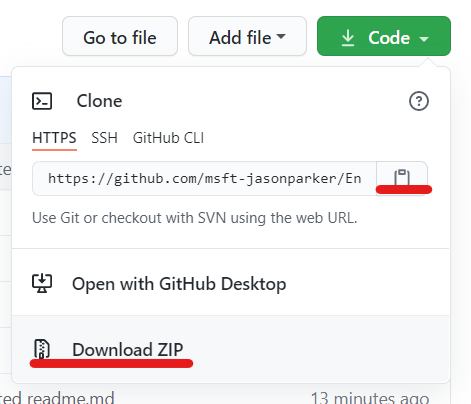
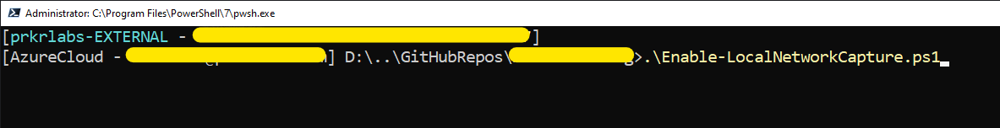
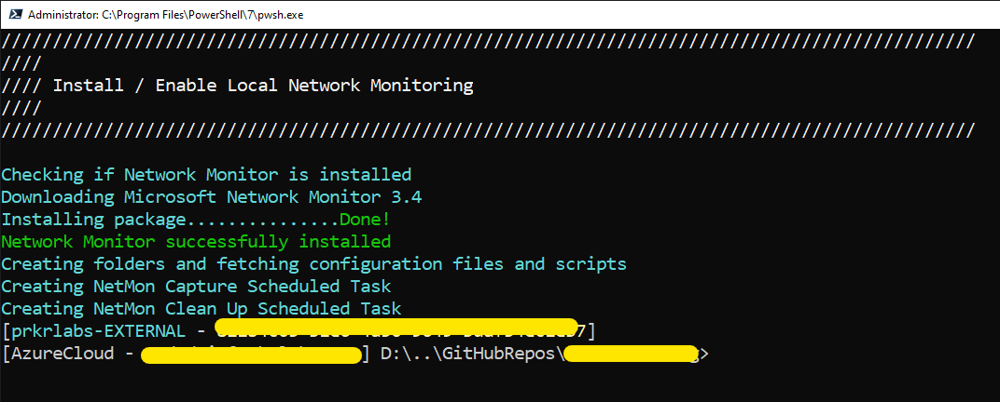
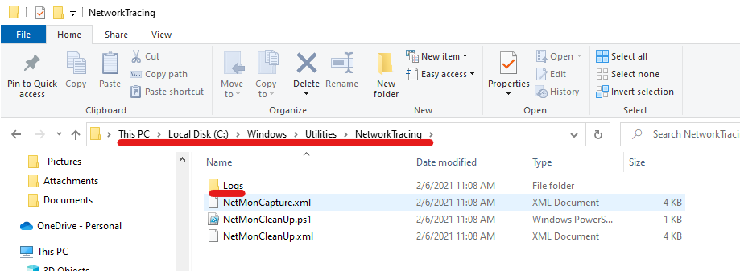
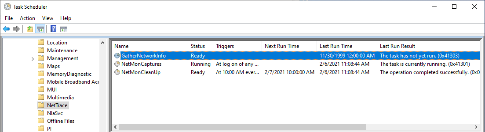

# Enable Local Network Capture

> *Based on Microsoft Network Monitor 3.4 (deprecated)*
## Overview

There are cases when troubleshooting network related issues it is helpful to have a local network packet capture. This is especially true when the issue you are troubleshooting is intermittent and not easily reproducable. Microsoft Network Monitor 3.4, while deprecated and no longer updated, is easy to install, use and configure for automated capturing.

## Contents

Item  |   Description
--- |   ---
Enable-LocalNetworkCapture.ps1  |   This is a single script which will download and install the application and configure the scheduled tasks
NetMonCapture.xml   |   XML file used to create a scheduled task for the packet capture
NetMonCleanUp.xml   |   XML file used to create a scheduled task to run the NetMonCleanUp.ps1 script (prunes the old capture files)
NetMonCleanUp.ps1   |   Script used to clean up capture files older than 3 days

## Getting Started

This is a very easy and straight forward solution. Follow the steps below:

1. Clone this repository or download and extract the zip file

    

2. Open PowerShell as an Administrator
3. Navigate to the directory where the Enable-LocalNetworkCapture.ps1 file is located

    

4. Run the script!

    

5. Location of the Utilities folder and capture logs

    

6. Validate the tasks were created and that the capture is running

    

> **NOTE:**
> 
> *If this is the first time running a script from the Internet, you'll need to update your execution policy*
>
> ``` Set-ExecutionPolicy -ExecutionPolicy ByPass -Scope CurrentUser ```

## The Code

``` PowerShell
<#
.SYNOPSIS
    Configures a local computer to capture network traces
.DESCRIPTION
    This script will download and install the (deprecated) Microsoft Network Monitor 3.4 application. Once installed, a scheduled task will be created to capture network traffic anytime a user is logged on to the computer. The captures files will rollover to a new file every 250MB. A separate task will pruned the logging directory for capture files older than 3 days. The solution files can be found in C:\Windows\Utilities and the tasks are created in Microsoft > Windows > NetTrace.
.EXAMPLE
    PS C:\> Enable-LocalNetworkCapture.ps1
    Single script operation will check and validate the computer is configured for network captures.
.NOTES
    Requires RunAs Administrator
#>
[CmdletBinding()]
Param ()
    BEGIN {
        #Requires -RunAsAdministrator
        Function Show-Menu {
            <#
                .SYNOPSIS
                    Shows a console based menu and title or just a console title banner in a variety of colors and stles.
                .DESCRIPTION
                    Create a console based menu and use this function to display it with a descriptive title bar. This function is primarily used to display the title bar in a variety of colors and sytles. It is useful when used to convey important information to the console operator.
            #>
            Param (
                # Single line title or banner used as a desciption or message to the console operator
                [Parameter(Position=0,Mandatory=$true)]
                [System.String]$Title,
        
                # Console based menu with multiple selection options
                [Parameter(Position=1,Mandatory=$false)]
                [System.String]$Menu,
        
                # Allows for a variety of style selections and sizes, default style (full)
                [Parameter(Position=2,Mandatory=$false)]
                [ValidateSet("Full","Mini","Info")]
                [System.String]$Style = "Full",
        
                # Foreground text colors
                [Parameter(Position=3,Mandatory=$false)]
                [ValidateSet("White","Cyan","DarkCyan","Magenta","Yellow","DarkYellow","Green","DarkGreen","Red","DarkRed","Gray","DarkGray","Blue","DarkBlue")]
                [System.String]$Color = "Gray",
        
                # Clears the console screen before displaying the menu / title
                [Parameter(Position=4,Mandatory=$false)]
                [Switch]$ClearScreen,
        
                # Does not prompt for menu selection, shows the menu display only.
                [Parameter(Position=5,Mandatory=$false)]
                [Switch]$DisplayOnly
            )
        
            [System.Text.StringBuilder]$menuPrompt = ""
            Switch($Style) {
                "Full" {
                    [Void]$menuPrompt.AppendLine("/" * (95))
                    [Void]$menuPrompt.AppendLine("////`n`r//// $Title`n`r////")
                    [Void]$menuPrompt.AppendLine("/" * (95))
                }
                "Mini" {
                    [Void]$menuPrompt.AppendLine("\" * (80))
                    [Void]$menuPrompt.AppendLine(" $Title")
                    [Void]$menuPrompt.AppendLine("\" * (80))
                }
                "Info" {
                    [Void]$menuPrompt.AppendLine("-" * (80))
                    [Void]$menuPrompt.AppendLine("-- $Title")
                    [Void]$menuPrompt.AppendLine("-" * (80))
                }
            }
        
            #add the menu
            If (-NOT [System.String]::IsNullOrEmpty($Menu)) { [Void]$menuPrompt.Append($Menu) }
            If ($ClearScreen) { [System.Console]::Clear() }
            If ($DisplayOnly) {Write-Host $menuPrompt.ToString() -ForegroundColor $Color}
            Else {
                [System.Console]::ForegroundColor = $Color
                Read-Host -Prompt $menuPrompt.ToString()
                [System.Console]::ResetColor()
            }    
        }

        $CurrentDirectory = Get-Location
        $TempPath = ("{0}\NetMon" -f $env:TEMP)
        $NetMonDownload = ("{0}\NM34_x64.exe" -f $TempPath)
    }
    PROCESS {
        Show-Menu -Title "Install / Enable Local Network Monitoring" -Style Full -DisplayOnly -ClearScreen -Color White
        Write-Host ("Checking if Network Monitor is installed") -ForegroundColor Cyan
        If (Test-Path -Path "C:\Program Files\Microsoft Network Monitor 3\nmcap.exe") { Write-Host ("Network Monitor is installed") -ForegroundColor Green }
        Else {
            Write-Host ("Downloading Microsoft Network Monitor 3.4") -ForegroundColor Cyan
            If (Test-Path -Path $TempPath) {
                (New-Object System.Net.WebClient).DownloadFile("https://download.microsoft.com/download/7/1/0/7105C7FF-768E-4472-AFD5-F29108D1E383/NM34_x64.exe",$NetMonDownload)
            }
            Else {
                New-Item -Path $TempPath -ItemType Directory | Out-Null
                (New-Object System.Net.WebClient).DownloadFile("https://download.microsoft.com/download/7/1/0/7105C7FF-768E-4472-AFD5-F29108D1E383/NM34_x64.exe",$NetMonDownload)
            }

            If (Test-Path -Path $NetMonDownload) {
                Write-Host ("Installing package") -ForegroundColor Cyan -NoNewline
                Set-Location -Path $TempPath
                & .\NM34_x64.exe /Q
                For ($i=0;$i -lt 15;$i++) {
                    Write-Host "." -ForegroundColor Cyan -NoNewline
                    Start-Sleep -Milliseconds 999
                }
                If (Test-Path -Path "C:\Program Files\Microsoft Network Monitor 3\nmcap.exe") {
                    Write-Host ("Done!") -ForegroundColor Green
                    Write-Host ("Network Monitor successfully installed") -ForegroundColor Green
                }
                Else {
                    Write-Warning ("Microsoft Network Monitor 3.4 - NOT INSTALLED!")
                    Exit
                }
            }
            Else {
                Write-Warning ("Microsoft Network Monitor 3.4 was not downloaded")
            }
        }

        Write-Host ("Creating folders and fetching configuration files and scripts") -ForegroundColor Cyan
        New-Item -Path "C:\Windows\Utilities\NetworkTracing\Logs" -ItemType Directory -Force | Out-Null
        (New-Object System.Net.WebClient).DownloadFile("https://raw.githubusercontent.com/msft-jasonparker/NetMonTracing/main/NetMonCapture.xml","C:\Windows\Utilities\NetworkTracing\NetMonCapture.xml")
        (New-Object System.Net.WebClient).DownloadFile("https://raw.githubusercontent.com/msft-jasonparker/NetMonTracing/main/NetMonCleanUp.xml","C:\Windows\Utilities\NetworkTracing\NetMonCleanUp.xml")
        (New-Object System.Net.WebClient).DownloadFile("https://raw.githubusercontent.com/msft-jasonparker/NetMonTracing/main/NetMonCleanUp.ps1","C:\Windows\Utilities\NetworkTracing\NetMonCleanUp.ps1")

        & SchTasks.exe /QUERY /TN '\Microsoft\Windows\NetTrace\NetMonCaptures' *>null
        If ($LASTEXITCODE -eq 1) {
            Write-Host ("Creating NetMon Capture Scheduled Task") -ForegroundColor Cyan
            & SchTasks.exe /CREATE /TN '\Microsoft\Windows\NetTrace\NetMonCaptures' /XML C:\Windows\Utilities\NetworkTracing\NetMonCapture.xml *>null
            If ($LASTEXITCODE -eq 0) { & SchTasks.exe /RUN /TN '\Microsoft\Windows\NetTrace\NetMonCaptures' *>null }
            Else { Write-Warning ("Failed to create NetMonCapture Scheduled Task") }
        }
        Else { Write-Host ("NetMonCapture Scheduled Task already exists") -ForegroundColor Green }

        & SchTasks.exe /QUERY /TN '\Microsoft\Windows\NetTrace\NetMonCleanUp' *>null
        If ($LASTEXITCODE -eq 1) {
            Write-Host ("Creating NetMon Clean Up Scheduled Task") -ForegroundColor Cyan
            & SchTasks.exe /CREATE /TN '\Microsoft\Windows\NetTrace\NetMonCleanUp' /XML C:\Windows\Utilities\NetworkTracing\NetMonCleanUp.xml *>null
            If ($LASTEXITCODE -eq 0) { & SchTasks.exe /RUN /TN '\Microsoft\Windows\NetTrace\NetMonCleanUp' *>null }
            Else { Write-Warning ("Failed to create NetMonCleanUp Scheduled Task") }
        }
        Else { Write-Host ("NetMonCleanUp Scheduled Task already exists") -ForegroundColor Green }
    }
    END {
        Get-ChildItem -Name null | Remove-Item -Force
        Set-Location $CurrentDirectory
    }
```